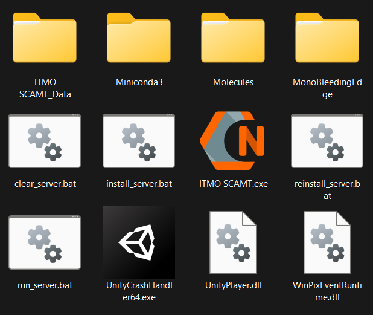

# Narupa ITMO SCAMT инструкция

## Установка и запуск
- Установить [SteamVR](https://store.steampowered.com/app/250820/SteamVR)
- Скачать архив с [клиентом](https://github.com/gosvoh/ITMO-SCAMT-Ilya/releases/latest) и распаковать
- Установить [.Net Framework 4.8](https://go.microsoft.com/fwlink/?linkid=2088631) и [VIVE SRanipal Runtime](https://dl.vive.com/SRSDK/runtime/VIVE_SRanipalInstaller.msi)
- Скачать архив с [сервером](https://github.com/gosvoh/ITMO-SCAMT-Ilya/releases/tag/Server) и распаковать в директорию с клиентом
- Запустить install_server.bat и дождаться процесса установки
- Запустить ITMO SCAMT.exe
- Для запуска своего набора молекул загрузите .pdb файлы в директорию Molecules
- Логи клиента и сообщения об ошибках сервера можно найти в директории logs

Содержимое директории после распаковки:

## Калибровка глаз
- Запустите SR_Runtime (он так же автоматически запускается при запуске ITMO SCAMT.exe)
- На панели управления SteamVR (чтобы открыть данную панель, нажмите кнопку под кругом на одном из контроллеров) найти значок глаза с надписью VIVE Pro Eye. Запустить калибровку и следовать инструкциям, которые будут показываться на экране.

[//]: # (## Для разработки)
[//]: # (Весь код, который разрабатывается нами в рамках данного проекта, должен находиться в папке Scripts.)
[//]: # (Для простоты работы с SDKRanipal, обращайтесь к статическому классу SRanipal из любого места в коде, который уже содержит необходимые статические методы в упрощенной форме для работы с SDKRanipal &#40;todo: описание методов&#41;.)

---

# Narupa ITMO SCAMT manual

## Installation and launch
- Install [SteamVR](https://store.steampowered.com/app/250820/SteamVR)
- Download the archive with the client [client](https://github.com/gosvoh/ITMO-SCAMT-Ilya/releases/latest) and unzip it
- Install [.Net Framework 4.8](https://go.microsoft.com/fwlink/?linkid=2088631) и [VIVE SRanipal Runtime](https://dl.vive.com/SRSDK/runtime/VIVE_SRanipalInstaller.msi)
- Download the archive with the [server](https://github.com/gosvoh/ITMO-SCAMT-Ilya/releases/tag/Server) and unzip it into the directory with the client
- Launch install_server.bat and wait for the installation process
- Launch ITMO SCAMT.exe
- Load the .pdb files into the Molecules directory to start your molecules kit
- Client logs and server error messages can be found in the logs directory

Contents of the directory after unpacking:

## Eye Calibration
- Run SR_Runtime (it also runs automatically when you run ITMO SCAMT.exe)
- On the SteamVR control panel (to open this panel, press the button under the circle on one of the controllers), find the eye icon labeled VIVE Pro Eye. Start the calibration and follow the instructions that will be shown on the screen.
